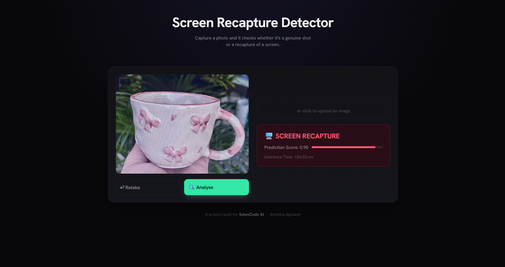
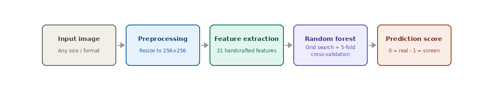
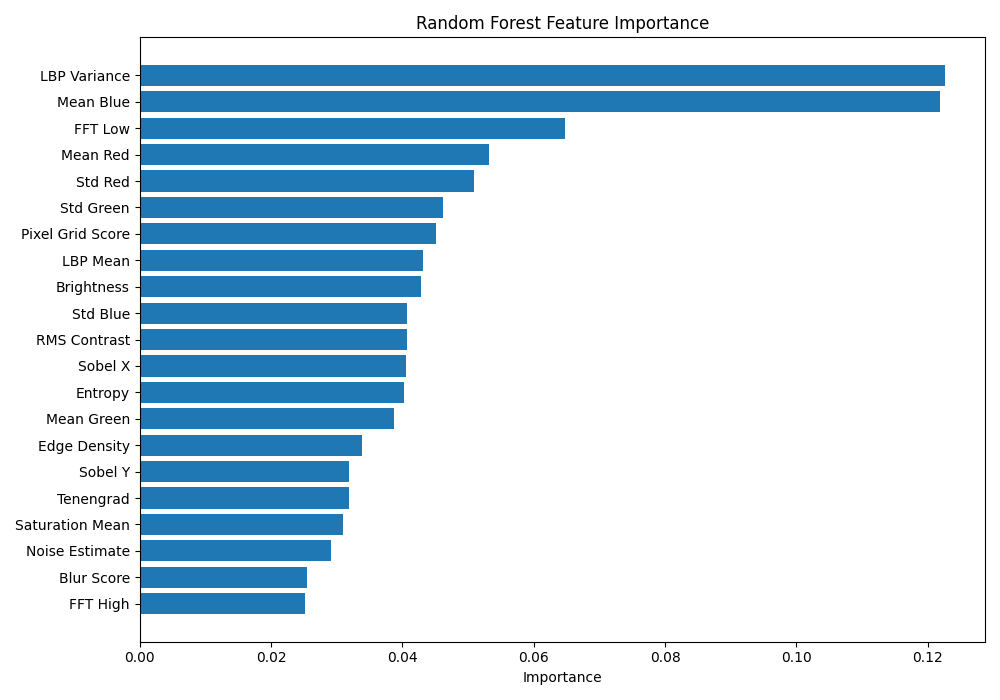
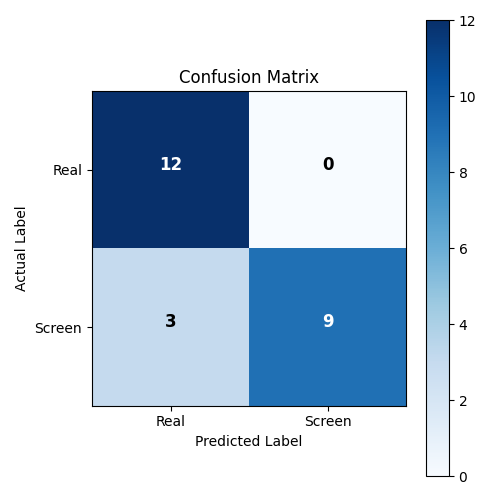

# 📸 Screen Recapture Detection using Handcrafted Image Features and Random Forest

Screen Recapture Detection is a lightweight computer vision application that classifies an input image as either a **real photograph** or a **screen recapture**. The project combines handcrafted image feature extraction with a Random Forest classifier to perform fast and efficient binary image classification.

The application includes a complete end-to-end pipeline for dataset creation, feature extraction, model training, hyperparameter optimization, performance evaluation, and real-time inference through both a command-line interface and an interactive Flask web application.The system delivers low-latency predictions while maintaining an interpretable machine learning workflow.

<p align="left">

</p>

## 🎯 Motivation

Digital verification systems increasingly depend on photographs submitted by users to verify identity, authenticate products, validate documents, or confirm physical presence. However, these systems remain vulnerable to screen recapture attacks, where an attacker photographs an image displayed on a phone, tablet, or computer monitor instead of capturing the original scene.

Since the semantic content of both images may be identical, conventional object recognition techniques are insufficient for detecting this type of fraud. 


## ✨ Features

- 📷 Real-time prediction through an interactive Flask web application
- 🖼️ Command-line prediction for single-image inference (`python predict.py image.jpg`)
- 🧠 Handcrafted image feature extraction using 21 computer vision features
- 📈 Feature importance analysis for model interpretability
- 🤖 Random Forest classifier optimized using GridSearchCV and 5-fold cross-validation
- 📊 Comprehensive model evaluation with accuracy, confusion matrix, and classification metrics
- ⚡ Low-latency inference with no GPU or external APIs required
- 📦 Lightweight and portable deployment suitable for resource-constrained environments


## 🛠️ Tech Stack

| Category | Technology |
|-----------|------------|
| Programming Language | Python 3 |
| Computer Vision | OpenCV, scikit-image |
| Machine Learning Framework | Scikit-learn |
| Classification Model | Random Forest |
| Data Processing | NumPy, Pandas |
| Data Visualization | Matplotlib |
| Web Framework | Flask |
| Model Serialization | Joblib |


## 📂 Project Structure
 
```
Screen-Recapture-Detection/
│
├── predict.py                  # Single-image prediction script (main deliverable)
├── app.py                      # Flask web demo — live camera in the browser
│

├── feature_engineering/
│   └── features.py             # All 21 feature extraction functions
|   └── create_dataset.py       # Builds features.csv from dataset/Real and dataset/Screen
|   └── features.csv            # Extracted feature vectors for the full dataset
│

├── model_train/
│   ├── model_training.py       # Grid search + cross-validation, saves best_random_forest.pkl
│   └── best_random_forest.pkl  # Final trained model
|   └── latency.py              # Benchmarks per-image inference time
│

├── dataset/
│   ├── Real/                   # Genuine photographs
│   └── Screen/                 # Photographs of a screen displaying an image
│
├── outputs/
│   ├── confusion_matrix.png       
│   └── feature_importance.png    
|   └── pipeline.png     
|    └── image.png     
│
└── README.md
```


## 📊 Dataset

The model was trained and evaluated on a self-collected dataset consisting of **120 images**, equally distributed across two classes:

- **60 Real Images** – Photographs captured directly using a smartphone camera under varying lighting conditions, viewing angles, distances, and backgrounds.
- **60 Screen Recapture Images** – Photographs of images displayed on mobile phones or laptop screens, captured under different viewing angles, distances, display brightness levels, and glare conditions.

To ensure the classifier learned **recapture-specific visual artifacts** rather than differences in scene content, the same or similar underlying scenes were intentionally used for both classes. This encourages the model to focus on characteristics such as **moiré patterns, pixel-grid textures, glare, color distortions, and frequency-domain artifacts**, which are commonly introduced during the screen recapture process.


## ⚙️ Methodology

<p align="left">

</p>

### Why Handcrafted Features?

Instead of relying on deep learning, this project adopts a handcrafted feature-based approach tailored to the available dataset size and deployment requirements. The extracted features capture image quality, texture, color distribution, gradient information, and frequency-domain characteristics that are commonly affected during the screen recapture process.

This approach offers several advantages, including low computational overhead, fast inference, interpretable feature importance, and reduced risk of overfitting on a relatively small self-collected dataset. As a result, the system remains lightweight, explainable, and well suited for real-time deployment on resource-constrained devices.


## 🧠 Feature Extraction

Each input image is transformed into a **21-dimensional handcrafted feature vector**, capturing multiple visual characteristics commonly associated with screen recapture artifacts. The extracted features are grouped into the following categories:

### 🔹 Image Quality & Texture
- Blur Score
- Edge Density
- RMS Contrast
- Tenengrad Sharpness
- LBP Mean
- LBP Variance

### 🔹 Frequency-Domain Features
- FFT High-Frequency Energy
- FFT Low-Frequency Energy
- Pixel Grid Score

### 🔹 Color Statistics
- Mean Red, Mean Green, Mean Blue
- Standard Deviation of Red, Green, and Blue Channels
- Brightness
- Saturation Mean

### 🔹 Gradient Features
- Sobel X Gradient
- Sobel Y Gradient

### 🔹 Statistical Features
- Entropy
- Noise Estimate

These handcrafted features capture variations in image quality, texture, color distribution, gradients, and frequency-domain information, enabling the classifier to identify visual artifacts commonly introduced during the screen recapture process.

All feature extraction logic is implemented in `features.py` and is consistently reused during dataset generation, model training, and inference, ensuring identical feature computation throughout the pipeline.

## 🤖 Model

To identify the most suitable classifier for screen recapture detection, multiple machine learning algorithms were trained and evaluated using the same handcrafted feature set. The models were compared based on their classification accuracy, robustness, inference efficiency, and interpretability.

### Model Comparison

| Model | Test Accuracy |
|-------------------------------|--------------|
| Decision Tree | 83.33% |
| K-Nearest Neighbors (KNN) | 75.00% |
| Support Vector Machine (SVM) | 70.83% |
| Gradient Boosting | 79.16% |
| Extra Trees | 85.2% | |
| **Random Forest** | **87.50%** |

**Random Forest** was selected as the final model due to its strong generalization performance, robustness on unseen samples, model interpretability through feature importance analysis, and stable inference performance.
| Hyperparameter | Value |
|----------------|-------|
| `n_estimators` | 200 |
| `max_depth` | 5 |
| `max_features` | `sqrt` |
| `bootstrap` | `True` |
| `min_samples_split` | 2 |
| `min_samples_leaf` | 1 |

The optimized model is serialized as **`model_train/best_random_forest.pkl`** and is shared across both the command-line prediction pipeline (`predict.py`) and the Flask web application (`app.py`), ensuring a consistent inference workflow across all deployment interfaces.

## 📈 Results

| Metric | Value |
|------------------------------|---------------------------|
| Test Accuracy | **87.50%** (80-20 split)|
| Average Inference Time/CPU | **67.01 ms/image** |
| Throughput | **14.92 images/second** |


<table align="center">
<tr>

<td align="center">


<b>Feature Importance</b>

</td>

<td align="center">



<b>Confusion Matrix</b>

</td>

</tr>
</table>


## 🚀 How to Run
 
**1. Install dependencies**
```bash
pip install -r requirements.txt
```
 
**2. Run prediction on a single image**
```bash
python predict.py path/to/image.jpg
```
Output: a single score from 0 (real) to 1 (screen recapture).
 
**3. Launch the live web demo**
```bash
python app.py
```
Then open **http://localhost:5000** in your browser.
- Grant camera permission — your live feed appears in the browser
- Hit **Capture** then **Analyse**, or simply **upload any image**
- The model runs on the backend and returns a result in milliseconds
 
**4. (Optional) Rebuild from scratch**
```bash
python create_dataset.py        # extract features → features.csv
python model_train/model_training.py   # grid search + train → best_random_forest.pkl
python latency.py               # benchmark inference speed
```

## 📌 Future Improvements

- Expand the dataset with a larger and more diverse collection of images captured across different smartphones, displays, lighting conditions, and viewing angles to improve model generalization.
- Evaluate lightweight deep learning architectures, such as **MobileNetV2**, and compare their performance with the handcrafted feature-based approach on a larger dataset.
- Incorporate additional texture and frequency-domain descriptors (e.g., **GLCM**, wavelet-based features) to improve the detection of subtle screen recapture artifacts.
- Optimize the inference pipeline for deployment on edge devices using model compression techniques such as **ONNX** or **TensorFlow Lite**.
- Deploy the Flask web application to a cloud platform (e.g., Render or Railway) to enable public access and real-time demonstration.


## 👩‍💻 Author
 
## Anshika Agrawal